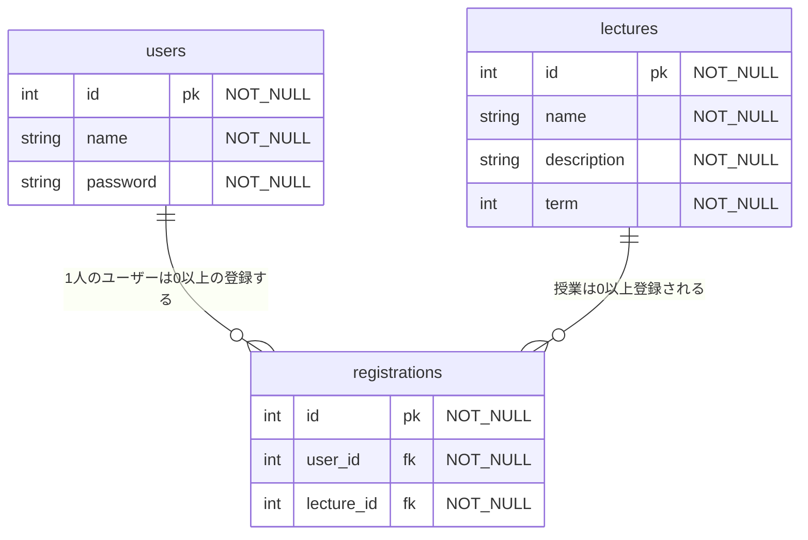

# README

- Database creation

```bash
rails db create
rails db:migrate
rails db:seed
```

- How to run the test suite

```bash
rspec spec/**/*
```

- Task
  スキーマ情報書き出し

```bash
bundle exec annotate --models
```

- rubocop

```bash
rubocop -a
```

## DB

created_at は省略



omit
授業を時間割のコマごとに管理する

```
  schedules {
    int id pk "NOT_NULL"
    int lecture_id fk "NOT_NULL"
    int timetable_id fk "NOT_NULL"
  }

  timetables {
    int id pk "NOT_NULL"
    int term "NOT_NULL"
    int day "NOT_NULL"
    int period "NOT_NULL"
  }
```

## API

### ユーザー

<details>
<summary>ログイン post /api/v1/auth/sign_in</summary>

````json
# request
## header
"content-type:application/json"
## body
{"email":"test@example.com", "password":"password"}

# response
## 200
※access-token,client,uidがheaderに入ります
{
  "data": {
    "email": "test1@example.com",
    "provider": "email",
    "uid": "test1@example.com",
    "id": 3,
    "allow_password_change": false,
    "name": null,
    "nickname": null,
    "image": null
  }
}

## 401
```json
{
  "success": false,
  "errors": [
    "ログイン用の認証情報が正しくありません。再度お試しください。"
  ]
}
````

</details>
<details>
<summary> ログアウト delete /api/v1/auth/sign_out</summary>

```json
# request
## header
"access-token: xxx"
"client: xxx"
"uid: test@example.com"
```

</details>
<details>
<summary>サインアップ post /api/v1/auth </summary>

```json
# request
## header
"content-type:application/json"
## body
{"email":"test@example.com", "password":"password", "password_confirmation": "password"}

# response
## 200
※access-token,client,uidがheaderに入ります
{
  "status": "success",
  "data": {
    "id": 3,
    "provider": "email",
    "uid": "test@example.com",
    "allow_password_change": false,
    "name": null,
    "nickname": null,
    "image": null,
    "email": "test1@example.com",
    "created_at": "2024-02-24T15:10:32.600Z",
    "updated_at": "2024-02-24T15:10:32.681Z"
  }
}

```

</details>
<details>
<summary>パスワード変更 put /api/v1/auth/password</summary>

```json
# request
## header
"content-type:application/json"
"access-token: xxx"
"client: xxx"
"uid: test@example.com"
## body
{"password":"newPassword", "password_confirmation": "newPassword"}

# response
## 200
{
  "success": true,
  "data": {
    "email": "test@example.com",
    "provider": "email",
    "uid": "test@example.com",
    "id": 2,
    "allow_password_change": false,
    "name": null,
    "nickname": null,
    "image": null,
    "created_at": "2024-02-24T14:53:24.438Z",
    "updated_at": "2024-02-24T14:59:00.700Z"
  },
  "message": "パスワードの更新に成功しました。"
}
```

</details>

### 授業

<details>
<summary>授業一覧取得 get /api/v1/public/lectures</summary>

```json
# response

{
  "first_term" [
    {
      "id": 1,
      "name": "テスト講義1",
      "term": "first_term"
    }
  ],
  "second_term" [
    {
      "id": 2,
      "name": "テスト講義2",
      "term": "second_term"
    }
  ]
}
```

</details>

<details>
<summary>授業単体取得 get /api/v1/public/lectures/:id</summary>

```json
# response

{
  "id": 1,
  "name": "テスト講義1",
  "description": "講義詳細",
  "term": "first_term"
}
```

</details>

### 授業登録

<details>
<summary>登録した授業一覧取得 get / registrations</summary>
</details>
<details>
<summary>授業登録 post / registrations</summary>
</details>
<details>
<summary>授業更新 patch / registrations</summary>
</details>
<details>
<summary>授業削除 delete / registrations</summary>
</details>
