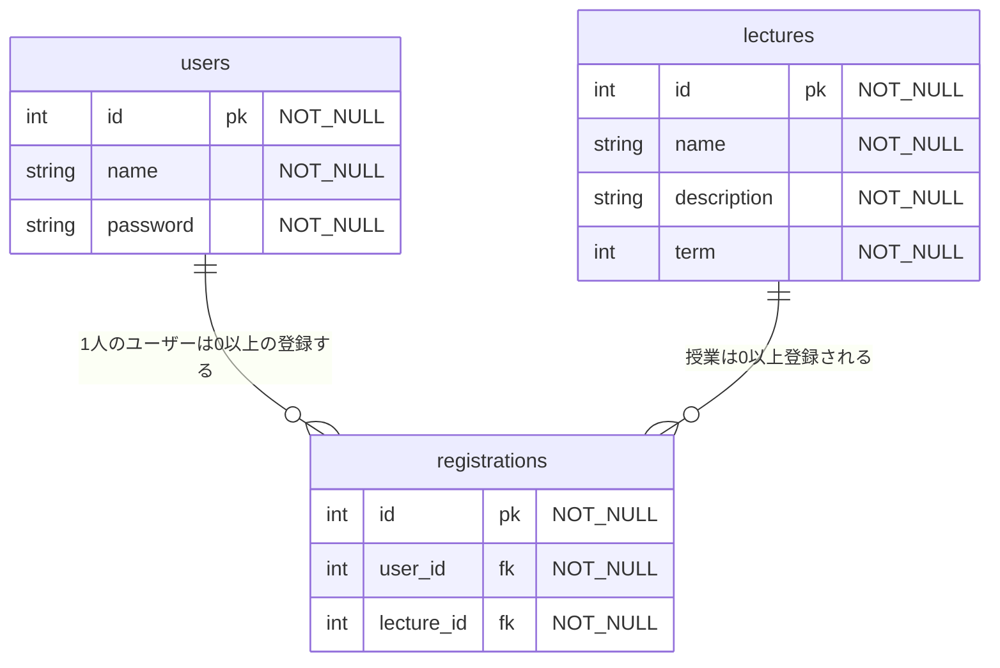

# README

- Database creation

```bash
rails db create
rails db:migrate
```

- How to run the test suite

- Deployment instructions

## DB

created_at は省略



omit
授業を時間割のコマごとに管理する

```
  schedules {
    int id pk "NOT_NULL"
    int lecture_id fk "NOT_NULL"
    int timetable_id fk "NOT_NULL"
  }

  timetables {
    int id pk "NOT_NULL"
    int term "NOT_NULL"
    int day "NOT_NULL"
    int period "NOT_NULL"
  }
```
